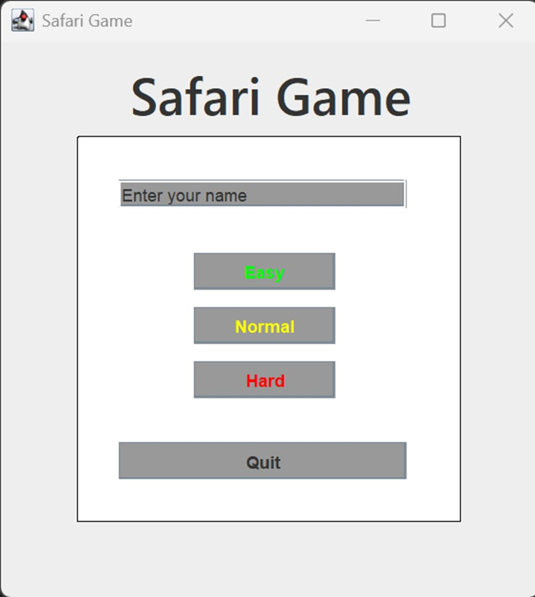
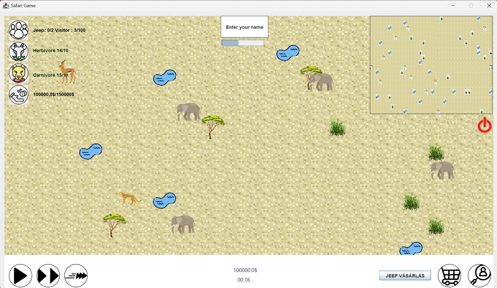
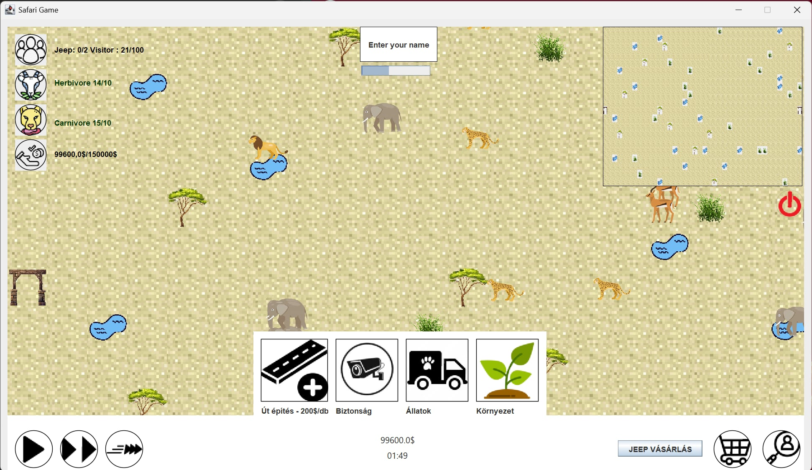
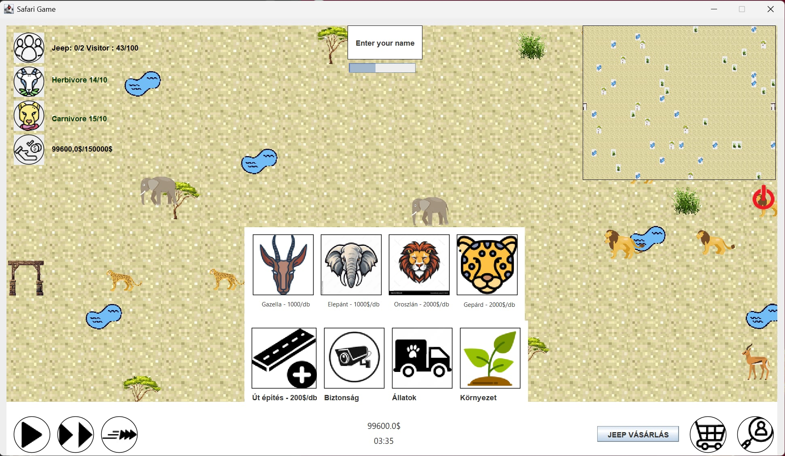
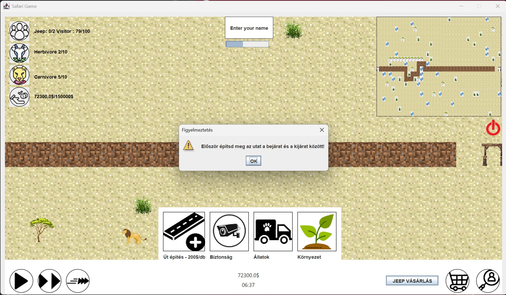
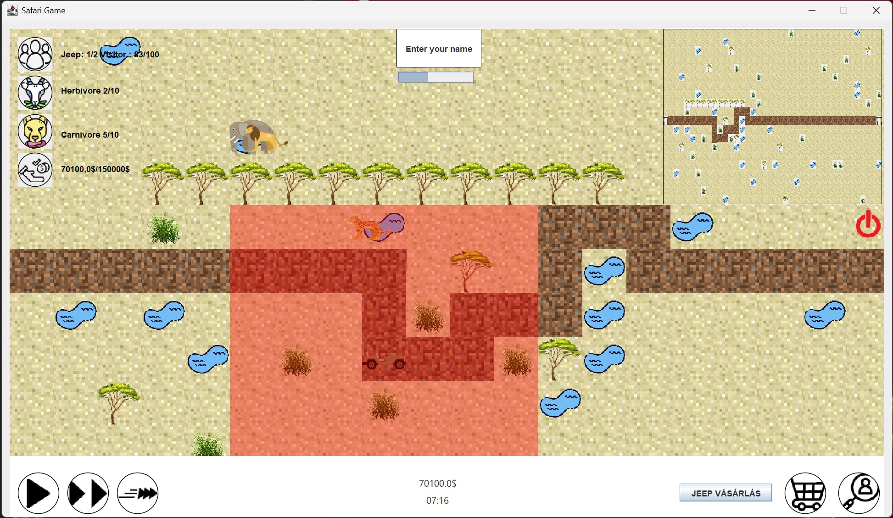
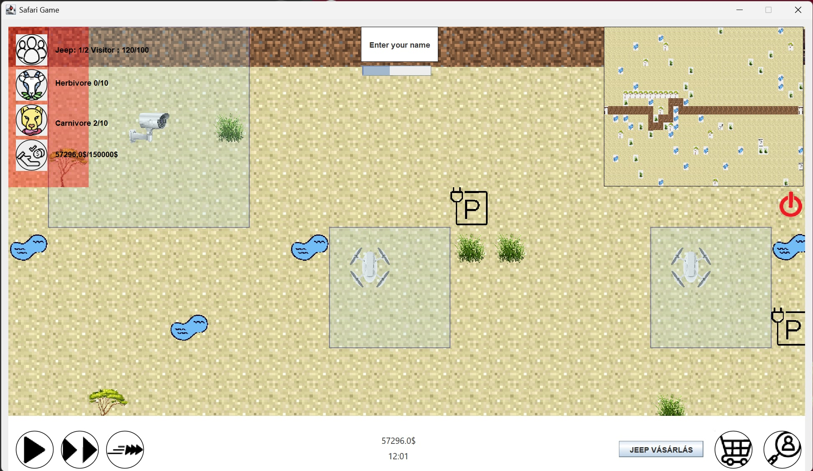
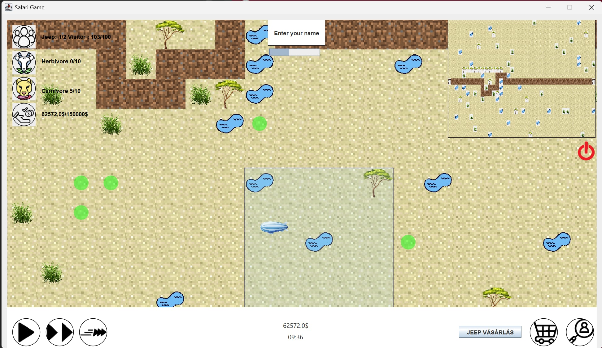
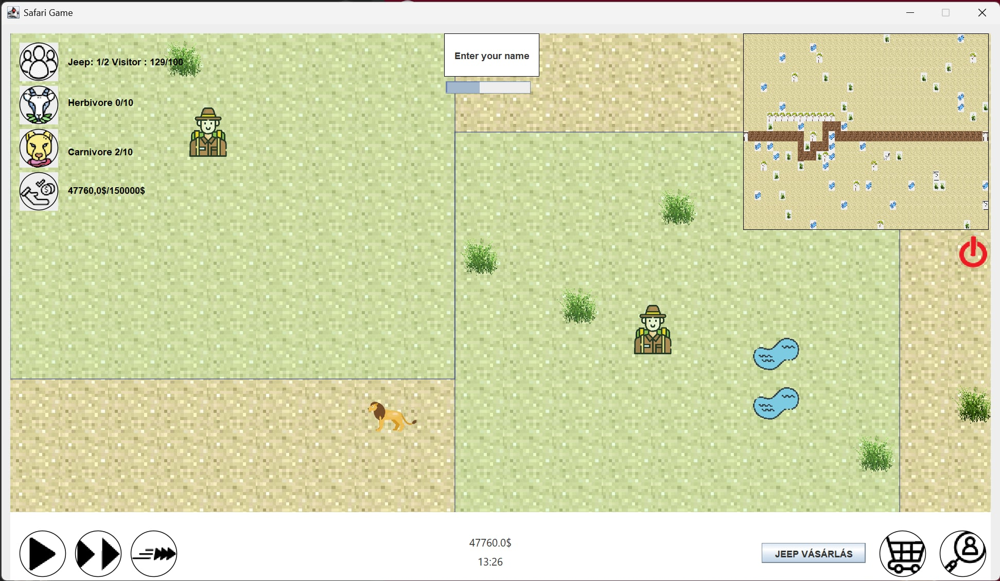

 <h1 >Safari game</h1>

  ELTE Szoftvertechnolódia tárgy beadandó feladata

<h3 >

# Mi is ez a játék?

A játék egy 2 dimenziós felülnézetes pályán játszódik, ahol a cél egy afrikai szafari működtetése parkigazgatói feladatok ellátásával. A játékot legalább 3 különböző sebességfokozattal játszhatjuk  
(óra / nap / hét), melyek között bármikor válthatunk a program futása közben. A játék 3 nehézségi fokozatot kell kínáljon legalább. 
 

- **Növények,vizes területek:** A pálya területén elszórtan nőnek bokrok és fák, valamint füves területek. A játékos maga is vásárolhat növényeket. Kisebb vízlelő helyek kezdetben is találhatók, de építeni is lehet tavakat. Legalább 3 féle növény legyen telepíthető. 
- **Állatok:** A szafariban szabadon élnek ragadozó és növényevő állatok. A növényevő állatok fákat, bokrokat, füvet ehetnek, míg a ragadozók növényevő állatokat. Mindkét csoportnak szüksége van vízre is az életben maradásához. Az állatok korlátozott ideig élnek, az idő előrehaladtával pedig öregszenek és többet is esznek.
- **Dzsippek**: A szafarit turisták látogatják, akik a kalandjukhoz dzsippet bérelnek. Egy dzsipp legfeljebb 4 utast képes elvinni. A dzsippeket a játékosnak kell megvásárolnia.
- **Utak**: A szafarinak van egy bejárata és egy kijárata. A járművek számára építeni kell egy vagy több járható utat, ami összeköti a bejáratot és a kijáratot. A járművek egy bejárattól kijáratig vezető véletlen módon választott úton visznek turistákat, visszafele pedig utasok nélkül térnek vissza a bejárathoz.  
- **Tőke**: A játékosnak adott a kezdő tőkéje, ebből vásárolhat növényeket, állatokat, dzsippeket, utakat és egyéb eszközöket. A szafari a bevételét állatok eladásából és turistákból fedezi (dzsipp bérlés). A turisták száma függ a belépődíj mértékétől, valamint attól, hogy amit látnak, mennyire tetszik számukra - vagyis szeretnének minél több és többfélébb állatot látni útjuk során.  
- **A játék vége**: A játékot akkor nyerjük meg, hogy ha elérjük, hogy a nehézségi szinttől függően 3, 6 vagy 12 egymást követő hónapban a látogatók, a növényevő, a ragadozó állatok száma, és a tőkénk is egy küszöbérték felett marad. A küszöbérték különböző a különböző kategóriáknál, pl. legalább 80 látogató, legalább 20 növényevő állat, stb. A játékot azonnal elveszítjük (az igazgatót kirúgják), ha csődbe megyünk, vagy kipusztul az összes állat. 

<h3>
 
# Plusz komplexitások a megvalósítás alatt

- **Minimap [0.5 komplexitás]** A játékpálya legyen nagyobb a megjelenítettnél, a navigáláshoz azt X és Y dimenzióban lehessen görgetni. A könnyebb tájékozódáshoz a játékhoz tartozzon navigálható minimap. 
- **Vadőrök [0.5 komplexitás]** Legyenek vadőrök, amelyeknek megadható, hogy mely ragadozót kell kilőniük. A kilőtt állat után pénzt kapunk, viszont	 a vadőröknek minden hónap elején előre kell fizetést adnunk.
- **Fejlett megfigyelő rendszer [1 komplexitás]**:Az orvvadászok elleni védekezéshez vásárolhatunk fixen telepített kamerákat, léghajót vagy drónt, amelyek napszaktól függetlenül felfedik a környezetüket egy bizonyos sugarú körben. A kamerák nem mozgathatók, de a léghajónak és a drónnak ki lehet jelölni járőrözési útvonalat. A léghajó egész nap képes fent maradni a levegőben, a drónoknak viszont óránként le kell szállniuk tölteni magukat. A töltőpontokat külön kell megvennünk és telepítenünk, ami előfeltétele a drónok vásárlásának.  
- **Irányítható vadőrök [0.5 komplexitás]**: A vadőrök legyenek irányíthatók úgy, kijelöljük számukra a lelőni kívánt orvvadászokat (ha felfedésre kerültek). Minden orvvadászért fejpénzt kapunk jutalmul. Az orvvadászok észrevehetik az őket üldöző vadőröket, és szintén lelőhetik őket. 

# Screenshots

  
  
  
  
  
  
  
  	
  

# Important Notes

# Készült

# Telepítés

# Futtatás
Futtatás: java -jar Safari_Game-1.0-SNAPSHOT.jar
Java 21 szükséges hozzá.
A .jar fájlt lehet .exe-vé csomagolni, de nem szükséges, és sokszor nem is szeretik, mert:
-platformfüggő,
-nem olyan megbízható (antivírus néha blokkolja).

# Credits

# Feedback 
Mivel a projekt még mindig béta állapotban van, esetleges problémák esetén, kérjük jelezzenek nekünk!

